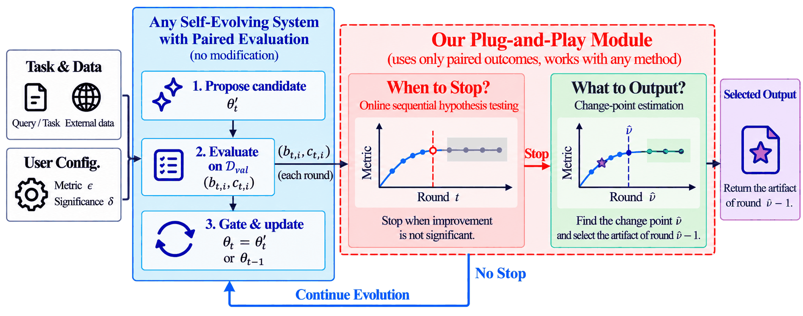

<p align="center">
  <h1 align="center">
  STOPS: Sequential Tests for Online stopping<br>and Plateau-based Selection<br>
  <sub><sub>Reference implementation of <i>When Is Enough Enough in Self-Evolving LLM Systems?</i></sub></sub>
  </h1>
  <p align="center">
    <strong>Enoch Yin</strong><sup>1</sup>
    &nbsp;&nbsp;
    <strong>Bin Liu</strong><sup>2✉</sup>
    &nbsp;&nbsp;
    <strong>Zhengling Qi</strong><sup>3✉</sup>
    <br>
    <sup>1</sup>Department of Statistics, The George Washington University&nbsp;&nbsp;
    <br>
    <sup>2</sup>School of Statistics and Data Science, School of Management, Fudan University&nbsp;&nbsp;
    <br>
    <sup>3</sup>Department of Decision Sciences, The George Washington University School of Business
    <br>
    <a href='https://arxiv.org/abs/2610.04756'></a>&nbsp;
    <a href='https://github.com/zyinaa/STOPS'></a>&nbsp;
    &nbsp;
    <a href='LICENSE'></a>
    <br>
    
  </p>
  <br>
</p>

## Abstract

Self-evolving large language model (LLM) systems repeatedly propose, evaluate, and incorporate updates to prompts, skills, or other persistent artifacts. Despite their growing effectiveness, these systems typically operate under a predetermined iteration or compute budget, without a principled criterion to determine when further evolution is no longer worthwhile. This can lead to two undesirable consequences: unnecessary computation after performance has saturated and the risk of returning late updates that overfit or exploit the evaluation signal. These issues motivate us to study two fundamental questions: *when should a self-evolving system stop, and what should it output once it stops?* We address the first by formulating an online sequential testing problem and constructing an anytime-valid restart detector using the per-item paired evaluation outcomes already produced by self-evolving LLM systems. We address the second by formulating a change-point estimation problem and using the estimated transition to select an earlier artifact for output. The resulting procedure is plug-and-play and requires no modification of the underlying self-evolving algorithms. Across two self-evolving frameworks, three LLM model families, and five benchmarks, our method substantially reduces computation costs while maintaining comparable unseen-test performance.

**In this repository.** `stops` watches the per-item paired outcomes `X = c − b ∈ {−1, 0, +1}` that a propose / evaluate / gate loop already produces and answers both questions online:

* **When to stop.** One betting wealth process restarts at every round; the alarm fires once the largest restart wealth reaches `1/δ`, i.e. once there is evidence that the expected gain of a proposal has fallen below `ε`. Under continued worthwhile improvement the average run length to a false alarm is at least `1/δ`.
* **What to output.** The restart with the most wealth at the alarm estimates when worthwhile improvement ended (`ν̂`); `stops` returns the incumbent from just before it, `θ_{ν̂−1}`.

No change to the underlying algorithm and no extra model calls.

## Installation

```bash
git clone https://github.com/zyinaa/STOPS.git
cd STOPS

pip install -e .                # core: no dependencies
pip install -e ".[dev,plot]"    # tests and figures (pytest, matplotlib)
```

**Requirements:** Python >= 3.9. No GPU and no API key are needed to use the detector or to reproduce the paper's stopping results.

## Usage

### Option A: Plug into your own loop

```python
from stops import Monitor

mon = Monitor(eps=0.01, delta=0.05)              # aGRAPA betting by default
inc = theta_0
for t in range(1, budget + 1):
    cand = propose(inc)
    b, c = evaluate(inc), evaluate(cand)         # per-item 0/1 on the same D_val
    mon.update(b, c, incumbent=inc)              # lists aligned by position, or {item_id: 0/1}
    if mon.alarm:
        return mon.selected                      # θ_{ν̂−1}
    inc = gate(inc, cand)
```

`python examples/minimal_loop.py` runs this against a toy system in a second. `Monitor.save` / `Monitor.load` persist the full state for long or resumable runs.

### Option B: SkillOpt (online, stops the run)

**Step 1: Apply the patch** to [SkillOpt v0.1.0](https://github.com/microsoft/SkillOpt/releases/tag/v0.1.0):

```bash
git clone https://github.com/microsoft/SkillOpt.git && cd SkillOpt
git checkout v0.1.0
git apply --ignore-whitespace /path/to/STOPS/integrations/skillopt/skillopt-v0.1.0.patch
pip install -e . && pip install -e /path/to/STOPS
```

**Step 2: Enable the monitor** in your SkillOpt YAML config:

```yaml
stops:
  enabled: true
  eps: 0.01
  delta: 0.05
```

**Step 3: Train as usual.** At every step the trainer will:

1. Write `steps/step_XXXX/paired_outcomes.json` with the incumbent's and the candidate's per-item validation outcomes.
2. Feed them to the monitor and append a line to `<out_root>/stops/rounds.jsonl`.
3. On alarm, stop after the current step, skip remaining slow and meta updates, and write `θ_{ν̂−1}` to `best_skill.md` and `<out_root>/stops/result.json`.

See [`integrations/skillopt`](integrations/skillopt/README.md) for all options, including baseline refresh after SkillOpt's slow updates.

### Option C: GEPA (online, no code change)

GEPA stops gracefully when `gepa.stop` appears in its `run_dir`. Run alongside it:

```bash
stops watch gepa runs/my_gepa_run --interval 30 --stop-file runs/my_gepa_run/gepa.stop
```

See [`integrations/gepa`](integrations/gepa/README.md).

### Option D: Replay a finished run

```bash
stops extract skillopt outputs/my_run -o my_run.json       # or: stops extract gepa runs/my_run --tokens-per-call 2249 -o my_run.json
stops detect my_run.json                                  # alarm round, ν̂, returned artifact, tokens saved
stops compare returned_results.jsonl full_results.jsonl   # paired unseen-test Δ and 95% CI
```

### Key Parameters

| Category | Parameter | Default | Meaning |
|----------|-----------|---------|---------|
| Detector | `eps` (ε) | `0.01` | Smallest expected per-round validation gain worth another round, in accuracy units. Larger ε stops earlier. |
| Detector | `delta` (δ) | `0.05` | False-alarm control: the alarm fires at `M_t ≥ 1/δ`. Smaller δ stops later. |
| Betting | `betting` | `agrapa` | `agrapa`: growth-optimal plug-in per restart. `mixture`: uniform mixture over fixed fractions. Both are valid. |
| Betting | `lambdas` (Λ) | `(0.1, 0.2, 0.4)` | Fractions for `mixture`. |
| Betting | `lam0` (λ₀) | `0.1` | aGRAPA fraction on a restart's entry round. |
| Betting | `lam_max` | `0.5` | Cap on any fraction (validity needs λ ∈ [0, ½]). |
| SkillOpt hook | `stop` | `true` | `false`: monitor and log only, never stop. |
| SkillOpt hook | `refresh_baseline` | `true` | Re-evaluate the incumbent once after a slow update, so the paired baseline really is `θ_{t−1}`. |
| SkillOpt hook | `replace_best` | `true` | On alarm, `best_skill.md := θ_{ν̂−1}`. |

Resolution scales with the validation size `n`: on a flat plateau the alarm needs roughly `log(1/δ) / (n · λ · ε)` rounds, so doubling `n` halves the smallest resolvable ε.

## Reproducing the Paper

`traces/` holds every run used in the paper as compact JSON (per-round paired counts, tokens, gate decisions) and `traces/test/` the per-item unseen-test outcomes. The stopping and cost results reproduce without any API calls:

```bash
pytest                                # 130 tests: unit, reference-equivalence, every paper cell
python paper/reproduce.py             # tables  -> paper/output/tables.md
python paper/reproduce.py --figures   # figures -> paper/output/*.png
```

| What | From | API needed |
|------|------|------------|
| `T_alarm`, `ν̂`, returned artifact (Tables 1 to 5, 7) | `traces/*.json` | no |
| Tokens to alarm and tokens saved | `traces/*.json` | no |
| Paired unseen-test Δ and 95% CI (Appendix C) | `traces/test/*.json` | no |
| New evolution runs | SkillOpt / GEPA | yes |
| Unseen-test accuracy of a new artifact | SkillOpt / GEPA evaluation | yes |

`paper/cells.json` maps each paper cell to its source run and expected numbers. To rebuild traces from raw run directories:

```bash
python scripts/build_traces.py --skillopt-outputs /path/to/SkillOpt/outputs --gepa-runs /path/to/gepa/runs
```

How runs become rounds (skipped steps, missing pairs, SkillOpt slow updates, GEPA parents) is documented in [`docs/conventions.md`](docs/conventions.md).

## Project Structure

```
STOPS/
├── assets/                          # Pipeline figure
├── docs/
│   └── conventions.md               # Rounds vs steps, missing pairs, slow updates, GEPA mapping
├── examples/
│   └── minimal_loop.py              # Toy self-evolving loop with the monitor (no API)
├── integrations/
│   ├── skillopt/                    # skillopt-v0.1.0.patch + setup notes
│   └── gepa/                        # stop-file workflow notes
├── paper/
│   ├── cells.json                   # Paper cell -> run, expected numbers
│   └── reproduce.py                 # Tables 1 to 7 and trajectory figures from traces
├── scripts/
│   └── build_traces.py              # Raw SkillOpt / GEPA runs -> traces/*.json
├── src/stops/
│   ├── monitor.py                   # Monitor: restart wealth W_t^(s), M_t, alarm, ν̂ (Algorithm 1, Eq. 3 to 6)
│   ├── betting.py                   # aGRAPA and fixed-mixture fractions (Appendix B)
│   ├── trace.py                     # System-independent trace format and replay
│   ├── readers/                     # SkillOpt and GEPA run directory -> trace
│   ├── evaluate.py                  # Paired unseen-test comparison (Appendix C)
│   ├── integrations/skillopt.py     # SkillOpt trainer hook
│   └── cli.py                       # stops extract | detect | watch | compare
├── tests/                           # Unit, reference-equivalence and paper regression tests
└── traces/                          # Paper runs as traces; traces/test: per-item test outcomes
```

## Citation

```bibtex
@article{yin2026enough,
  title   = {When Is Enough Enough in Self-Evolving {LLM} Systems?},
  author  = {Yin, Enoch and Liu, Bin and Qi, Zhengling},
  journal = {arXiv preprint arXiv:2610.04756},
  year    = {2026},
  url     = {https://arxiv.org/abs/2610.04756}
}
```

## Acknowledgements

The SkillOpt integration builds on [SkillOpt](https://github.com/microsoft/SkillOpt) and the GEPA integration on [GEPA](https://github.com/gepa-ai/gepa). The detector follows the e-detector construction of Shin, Ramdas and Rinaldo (2024) and the betting framework of Waudby-Smith and Ramdas (2024).

## License

This project is licensed under the [MIT License](LICENSE).
